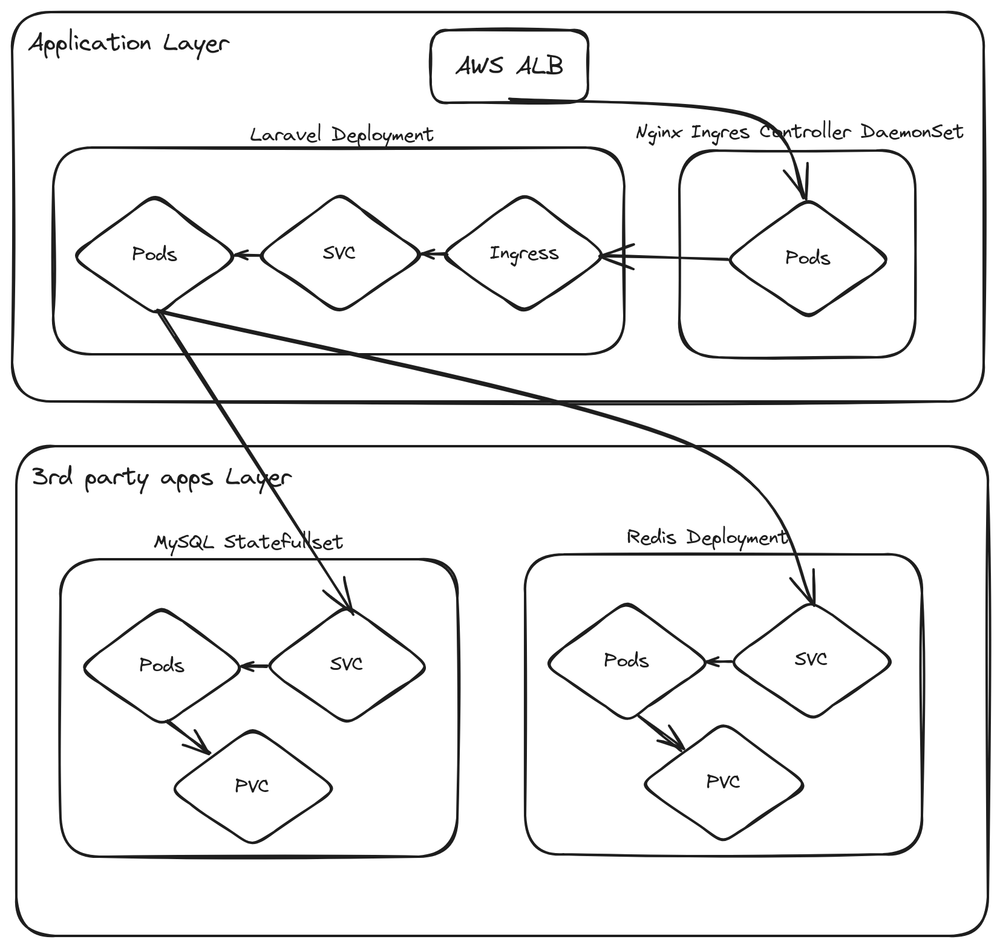

# Laravel Application Deployment on Kubernetes

This README provides guidance on deploying a Laravel application on a Kubernetes cluster using Docker and Helm.

## Prerequisites

Before proceeding, ensure you have the following installed:

* Docker
* Kubernetes cluster (e.g., minikube, kind, or a cloud-based Kubernetes service)
* Helm 3
* kubectl (configured to connect to your Kubernetes cluster)
* Docker Compose (optional, for local testing)

## Deployment Steps

### 1. Clone the Repository

Clone this repository to your local machine. This repository contains the Dockerfile, Helm chart, and other necessary configurations for deployment.

```bash
git clone https://github.com/Osama-Yusuf/laravel-helm.git
cd laravel-helm
```

### 2. Build and Push Docker Image (Optional)

First if you want to rebuild the Docker image and push to your repository:

* Navigate to the Laravel project directory.

    '''bash
    cd laravel_app
    '''

* Build the Docker image:
    
    ```bash
    docker build -t yourusername/laravel-kubernetes:latest .
    ```
    
* Push the image to Docker Hub:
    
    ```bash
    docker push yourusername/laravel-kubernetes:latest
    ```

Note: Make sure to replace the image name in `values.yaml` with your own image name.

### 3. Deploy Using Docker Compose (Optional)

For local testing with Docker Compose:

* Navigate to the Laravel project directory.

    '''bash
    cd laravel_app
    '''

* Run the following command in the directory containing `docker-compose.yaml`:
    
    ```
    docker-compose up -d
    ```
    
* Access the application at `http://localhost:8000`.

## Provisioning EKS with Terraform (Optional)

Provision an Amazon EKS cluster with Terraform. The cluster is configured with a minimum of 1 node, a maximum of 3 nodes, and a desired count of 2 nodes.

### Prerequisites

Before you begin, ensure you have the following installed:

* Terraform
* AWS CLI

### Configuration and Deployment

1. **Configure AWS CLI**:
    
    * Set up your AWS credentials and default region. Replace `YOUR_ACCESS_KEY` and `YOUR_SECRET_KEY` with your actual AWS access key and secret key.
        
        ```bash
        aws configure set aws_access_key_id "YOUR_ACCESS_KEY"
        aws configure set aws_secret_access_key "YOUR_SECRET_KEY"
        aws configure set default.region us-west-2
        ```
        
2. **Initialize and Apply Terraform**:
    
    * Navigate to the Terraform directory:
        
        ```bash
        cd terraform
        ```
        
    * Initialize Terraform:
        
        ```bash
        terraform init
        ```
        
    * Apply the Terraform script to create the EKS cluster:
        
        ```bash
        terraform apply --auto-approve
        ```
        
3. **Update Kubernetes Configuration**:
    
    * Once the cluster is created, update your `kubectl` configuration to interact with the new cluster:
        
        ```bash
        aws eks update-kubeconfig --name example-eks-cluster --region us-west-2
        ```
        
    Note: Ensure the region matches the one you configured in the AWS CLI.

4. **Deploy and configure storate class for EKS**:

    * Give permission to the script and run it:

        '''bash
        chmod +x sc.sh
        ./sc.sh
        '''

### Accessing the EKS Cluster

After completing these steps, your EKS cluster should be up and running. You can interact with it using `kubectl` to deploy applications, manage resources, and more.

### 4. Deploy on Kubernetes

First deploy the nginx ingress on Kubernetes using Helm:

* Install the Helm chart:
    
    ```bash
    helm install  ingress-nginx ingress-nginx   --repo https://kubernetes.github.io/ingress-nginx   --namespace ingress-nginx --create-namespace
    ```

* Get the public IPs of the load balancer created by the ingress controller:

    ```bash
    dig +short <DNS>
    ```

* add the IPs to the hosts file:

    ```bash
    sudo vim /etc/hosts
    ```

* add the following line to the hosts file:

    ```bash
    <IP> laravel.app.com
    ```

Then deploy the application with all its 3rd parties on Kubernetes using Helm:

* Navigate to the Helm chart directory.

    '''bash
    cd helm
    '''

* Install the Helm chart:
    
    ```bash
    helm install myapp -f values.yaml .
    ```
    
* Monitor the deployment status using `kubectl`:
    
    ```bash
    kubectl get pods
    ```

* Once the pods are running, access the application at `http://laravel.app.com`.
    
## Architecture Diagram

Below is the architecture diagram showing how the Laravel application is distributed within the Kubernetes cluster:



This diagram illustrates the interaction between different components of the application, including:
- The PHP pod hosting the Laravel application.
- MySQL database managed as a StatefulSet.
- Redis deployment used for caching.
- A Load Balancer to route external traffic to the PHP pod.
- Persistent Volume Claims (PVCs) attached to both MySQL and Redis for data persistence.

## Assumptions and Prioritization

* **Performance**: Assumed that the application's performance is critical, so resources can be adjusted in `values.yaml`.
* **Security**: Sensitive data like passwords are managed through Kubernetes Secrets to enhance security.
* **Scalability**: Designed the Helm chart for easy scalability, allowing for increased replicas and resources.

## Testing Process

* **Local Testing**: Initially tested the application using Docker Compose to ensure the Docker container functions correctly.
* **Helm Chart Testing**: Deployed the application on a minikube Kubernetes cluster using the Helm chart. Monitored pods and services for correct operation, then eventually on an eks as a final check with the terraform.
* **Issue Resolution**: Encountered issues with service connectivity which were resolved by adjusting port configurations in the Helm templates.